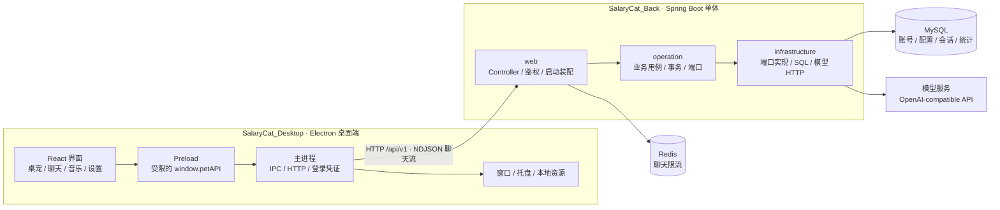
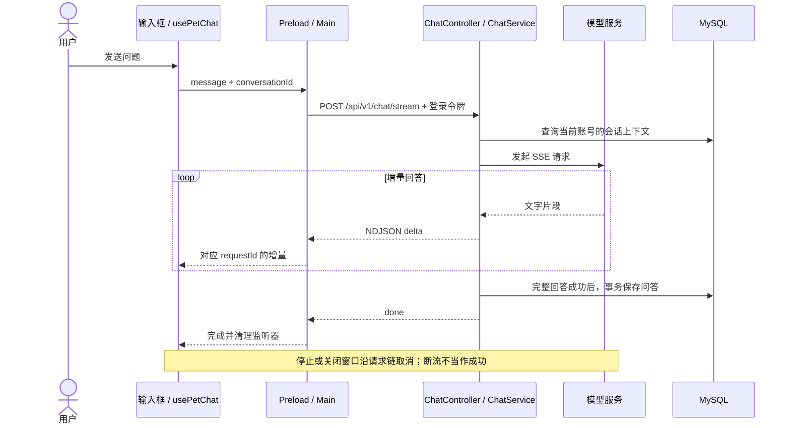
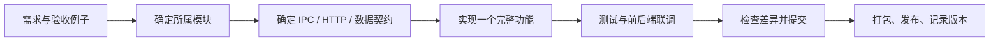

# 月薪喵：架构与开发流程

这份文档是前后端开发的入口。先确定功能属于哪一层，再改代码。下文区分当前实现和待实施方案；本轮只清理冗余，不混入新功能或大规模文件搬迁。

## 1. 整体架构（当前实现）



这是运行调用图。后端编译依赖见后端 `docs/architecture.md`；应用服务通过端口调用实现，不直接引用 infrastructure 模块。

边界约定：界面负责交互；Preload 只暴露明确的 API；主进程负责桌面能力和后端通信；后端负责认证、业务数据和模型调用。模型 Key 保存在后端，不进入聊天 IPC。

## 2. 现在从哪里读代码

```text
src/
├─ main/
│  ├─ index.ts                 应用启动、窗口和资源协议
│  ├─ backend/                 HTTP、凭证刷新、NDJSON 解析
│  ├─ ipc/                     界面请求入口、聊天取消和超时
│  ├─ window/                  桌宠窗口
│  └─ tray/                    系统托盘
├─ preload/index.ts            window.petAPI 安全桥
├─ renderer/
│  ├─ main.tsx                 React 入口
│  ├─ pages/                   桌宠、设置、登录页面
│  ├─ components/pet/          小猫、聊天、音乐按钮和设置表单
│  ├─ scripts/pet/             行为、聊天、音乐、偏好与状态
│  └─ styles/                  现有样式（待按功能归位）
└─ shared/                     IPC 类型、默认配置、错误处理
resources/                     必需的 GIF、音乐、图标、角色清单
scripts/                       Electron 安装检查和桌面集成测试
```

阅读顺序：`main/index.ts` → `preload/index.ts` → `renderer/main.tsx` → `pages/pet/PetPage.tsx` → `scripts/pet/Pet.tsx`。

| 要改什么 | 主要入口 |
| --- | --- |
| 桌宠组装、拖动、鼠标穿透 | `scripts/pet/Pet.tsx` |
| 动作、休眠、思考和计时器 | `scripts/pet/usePetBehavior.ts` |
| 发送、停止、新对话、会话 ID | `scripts/pet/usePetChat.ts` |
| 音乐播放、暂停、循环、播放时长 | `scripts/pet/usePetDance.ts` |
| GIF 和减少动态效果 | `components/pet/PetSprite.tsx` |
| 输入框、Markdown 气泡 | `PetChatInput.tsx`、`PetSpeechBubble.tsx` |
| 设置加载、保存、账号切换 | `pages/pet/useAccountSettings.ts` |
| 设置表单 | `components/pet/PetSettingsModal.tsx` |
| 后端连接、登录恢复、令牌刷新 | `main/backend/client.ts` |
| 流解析、请求取消 | `main/backend/chatStream.ts`、`main/ipc/chatHandlers.ts` |
| 新增跨进程能力 | `shared/contracts.ts` → 主进程 handler → `preload/index.ts` |

## 3. 一次聊天的完整流程



历史最多 20 条、24,000 字符，查询按当前用户隔离。取消、超时或上游失败不保存半轮问答。前端失败时保留草稿和已收到的文字；切换账号或新建对话清空会话 ID。

## 4. 数据归属

| 数据 | 负责位置 |
| --- | --- |
| 输入草稿 | 输入框组件 |
| 当前请求、会话 ID | `usePetChat`，当前运行期间有效 |
| 动画、提示、行为计时器 | `petStore` + `usePetBehavior` |
| 播放器与实际播放状态 | `usePetDance` |
| 外观、行为、音乐偏好 | 本机 localStorage；BroadcastChannel 同步设置窗口 |
| 登录令牌 | Electron 主进程及系统加密的本机文件 |
| 模型配置、模型 Key | 后端；Key 加密保存、不回显 |
| 用户、聊天记录、使用统计 | MySQL |

## 5. 下一步整理方案（尚未搬迁）

前端主要问题是同一个功能分散在 components、scripts、pages，设置表单和全局 CSS 也过于集中。目标是按功能收拢文件，保留 Electron 四层边界：

```text
src/renderer/
├─ pages/                 只组装页面
├─ features/
│  ├─ pet/                桌宠行为、角色显示、拖动
│  ├─ chat/               输入、回复、聊天请求状态
│  ├─ music/              播放器、音乐按钮
│  ├─ settings/           设置加载与各设置分区
│  └─ auth/               登录界面与账号交互
└─ shared/                被多个功能使用的 UI 和基础样式
```

组件、hook、专属样式和测试放在所属功能内。共享数据先约定归属，避免互相修改内部状态。暂不增加框架、通用组件库或更多后端模块。

按这个顺序逐步做，每一步单独验证：

1. **清理基线（本轮）**：删除 README 截图引用、无引用代码和重复配置；停止生成测试截图；统一 npm；修正文档。旧生成目录的实际删除状态见下文。
2. **前端归位**：先聊天，再音乐和桌宠，最后拆设置表单及样式。每次只移动一个功能，不夹带行为修改。
3. **后端边界**：保留五模块，从一个用例开始分离 HTTP DTO 与应用命令，逐步收拢数据访问与配置职责。
4. **再开发功能**：目录稳定、契约明确、回归通过后，按下面的流程迭代。

## 6. 每个需求的开发流程



开始写代码前，用几行写清：**用户操作、期望结果、失败时怎么办、修改哪些模块、怎样验收**。涉及接口先更新后端 `docs/api-contract-v1.md`；涉及数据库新增 Flyway 迁移，不改已执行的迁移文件。

实现时先打通后端用例与接口，再接主进程/Preload，最后完成界面；纯界面需求只改界面。一次提交围绕一个目的，功能、目录迁移、依赖升级分开做。完成后记录实际检查及未覆盖范围。

| 改动范围 | 检查 |
| --- | --- |
| 前端逻辑与组件 | `npm test`、`npm run build` |
| 音乐、GIF、桌宠布局 | 再运行 `npm run test:desktop` |
| IPC、流式聊天、设置通信 | 再运行 `npm run test:chat-desktop` |
| Java 后端 | 后端目录执行 `mvn verify` |
| HTTP 契约或数据库 | 更新契约/迁移说明，在独立测试环境联调正常、失败、取消和账号隔离 |
| 发布 | 相关检查通过后 `npm run dist`，安装验证并确认后端版本兼容 |

现有自动化测试使用本地测试数据，不调用付费模型、不写真实数据库，不能替代发布前的真实服务联调。

现有行为必须保持：**暂停音乐后 GIF 继续；音乐按钮无文字标签；暂停图标为音符加斜线；缩放范围 80%–100%；流式回复可停止；账号数据隔离。**

## 7. 产物与清理约定

- Git 保留源码、必要素材、配置模板、依赖锁文件、有效测试及文档。
- `out/` 只放 Electron 构建结果；`release/` 只放打包结果，都可重新生成。
- 桌面测试使用系统临时目录，退出后清理；GIF 采样只在内存进行，不再保存问答截图。
- AI 回复截图、临时排查脚本、个人笔记和旧安装包不放进源码目录及 README。
- 保留运行素材、本机密钥和用户数据；清理产物不清理业务数据。
- 前端统一 `npm` 与 `package-lock.json`，不并行维护第二套锁文件。

本次旧目录清理尚有遗留：`.venv/`、`release/`、空的 `electron/` 和 `out/chat-smoke/`、`out/dance-smoke/`。递归删除被工具策略拒绝，文件仍在；这些目录已核对为旧环境或生成产物，后续可手动清理。旧 smoke 产物已排除在安装包收集范围外。
